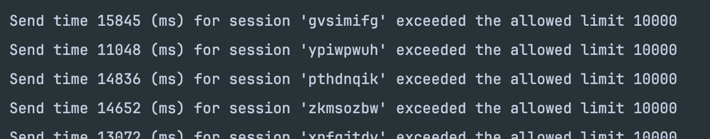
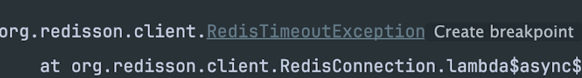
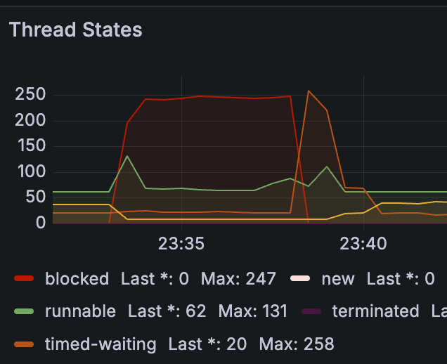
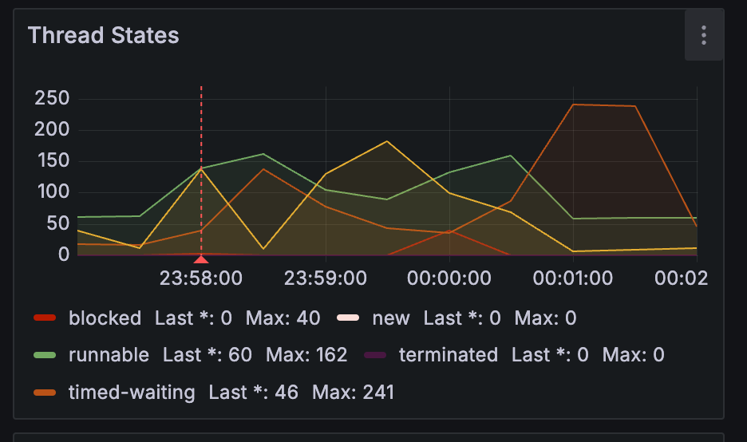

## 🎮 프로젝트 소개

<br>

## 🚀 프로젝트 개요

### **게임 장인들과 함께하는 실시간 피드백 & 재능 거래 C2C 플랫폼**

게임을 더 잘하고 싶나요? 이제 게임 커뮤니티에서 각 장르의 장인들과 직접 소통하며 실시간 피드백을 받을 수 있습니다! 우리 플랫폼에서는 고수들의 노하우를 실시간으로 전수받을 수 있는 거래 시스템을 제공합니다. 원하는 게임의 장인을 찾아 직접 피드백을 받고, 스킬을 향상시켜 보세요.

개발 기간: 2025.02.10 ~ 2025.03.17

<br>

|                                  Level_UP Team Notion                                  |                                                                                      발표 보고서                                                                                      |
| :------------------------------------------------------------------------------------: | :-----------------------------------------------------------------------------------------------------------------------------------------------------------------------------------: |
| [Notion 보러가기](https://www.notion.so/teamsparta/9-1962dc3ef51480d5b934d27f143c3c41) | [발표 보고서 보러가기](https://docs.google.com/presentation/d/1QeAYLnKef6MefFW1xK3BqIidN0l4MeFZ/edit?usp=drive_link&ouid=103470562990121621342&rtpof=true&sd=true) |

<br>

## 👤 팀원 소개


|                                                                       김효중                                                                       |                                                                        최대현                                                                        |                                                                      이경훈                                                                      |                                                                      이동건                                                                       |                                                                     정영균                                                                     |
|:-----------------------------------------------------------------------------------------------------------------------------------------------:|:-------------------------------------------------------------------------------------------------------------------------------------------------:|:---------------------------------------------------------------------------------------------------------------------------------------------:|:----------------------------------------------------------------------------------------------------------------------------------------------:|:-------------------------------------------------------------------------------------------------------------------------------------------:|
| <a href="https://github.com/rlagywnd4" target="_blank"></a> |  <a href="https://github.com/DeaHyun0911" target="_blank"></a>   | <a href="https://github.com/kyung412820" target="_blank"> </a> | <a href="https://github.com/LeeDong-gun" target="_blank"> </a> | <a href="https://github.com/lq0920084" target="_blank"></a> |
|                                                   [@rlagywnd4](https://github.com/rlagywnd4)                                                    |                                                  [@DeaHyun0911](https://github.com/DeaHyun0911)                                                   |                                                           [@kyung412820](https://듯)                                                           |                                                 [@LeeDong-gun](https://github.com/LeeDong-gun)                                                 |                                                 [@lq0920084](https://github.com/lq0920084)                                                  |
|                                                                   커뮤니티<br/>댓글                                                                   |                                                                    리뷰<br/>채팅<br/>배포                                                                    |                                                                      상품                                                                       |                                                                   주문<br/>결제                                                                    |                                                                     회원                                                                      |

<br>


<br>

## 🎯 **Flow Chart**
<br>


## 📝 **와이어프레임**


## 💬 **ERD**


## 🏆 **Architecture**


<br>

## 📚 **기술 스택**

### Front-End
[](https://skillicons.dev)

### Back-End
[](https://skillicons.dev)

### DevOps
[](https://skillicons.dev)

### Tools
[](https://skillicons.dev)


# 🎯 프로젝트 주요 기능

### 1. 회원

- JWT 및 Spring Security 설정을 통해 인증 및 인가 로직 구현
- OAuth 2.0을 사용하여 소셜 로그인 기능 구현


### 2. 상품

- Mysql, JPA기반 상품 생성/조회/수정/삭제 REST API 제공
- ElasticSearch를 활용한 빠르고 정확한 검색 기능
  - **키워드 검색**: 상품명, 게임 장르, 설명(Contents) 등을 기반으로 검색 가능
  - **자동 완성(Auto-Suggest)**: 입력 중인 검색어에 대한 추천어 제공
  - **필터링 및 정렬**: 가격, 인기순, 최신 등록일 등의 필터 및 정렬 기능
  - **리뷰 감성 분석**: 검색 결과에 포함된 리뷰의 감성 점수를 분석하여 긍정적/부정적 리뷰 제공

### 3. 주문 / 결제
- **토스페이먼츠 결제** : 카드, 간편결제, 계좌이체 토스페이 지원
- **알림 서비스** : 결제 관련 알림 전송
- **환불 서비스** : 결제 취소 및 환불기능 지원
- **편리한 승인** : 결제 승인 실패 시 재시도 전략 적용
- **재고관리** : 상품의 인원수 제한 필드를 활용한 재고관리 기능 제공


### 4. 채팅

- Websocket, STOMP, MongoDB기반 실시간 채팅 서비스 제공
- 채팅방 생성/조회/삭제 REST API 제공

### 5. 커뮤니티

- Mysql, JPA기반 커뮤니티,댓글 CRUD REST API 제공

### 6. 모니터링

서비스의 원활한 운영을 위해 **실시간 모니터링 시스템**을 구축하여 장애 예방 및 성능 개선을 지원합니다.

- **로그 모니터링(Log Monitoring)**: Logstash & Filebeat를 활용하여 서버 및 애플리케이션 로그 수집
- **모니터링 시각화**: Kibana를 활용한 시스템 로그, 데이터 관리 시각화
- **ElasticSearch 검색 성능 모니터링**: 검색 응답 시간 및 인덱스 크기 모니터링


# 🔧 **트러블 슈팅**
<details>
<summary>[이경훈] 엘라스틱 서치 사용 이유와 검색 속도 개선</summary>

- Mysql로 기존의 30만 이상의 데이터에서 특정 단어가 포함된 데이터를 조회시 속도가 조금 느리다는 판단을 함(4.932초)
- 속도의 개선을 위해서 캐시를 적용하거나 페이징을 통해 카테고리화를 수행하여 속도를 올려봄
- **속도를 개선하다보니 많은 현업의 몇 천만 데이터를 관리하기 위해서는 새로운 해답이 필요하다 생각하게 됨**
- 레디스를 찾다가 엘라스틱 서치라는 것을 알게되어 적용 시작
- **Mysql과 다른 역인덱스 구조가 검색의 속도를 비약적으로 빠르게 해준다는 것을 학습**, 적용함
- Mysql에서 일부를 처시할 경우 5초가 걸렸지만 엘라스틱 서치의 힌트와 캐시를 적용한 후엔 0.2초가 걸리게 바뀜
- 최종적으로 엘라스틱 서치를 적용하여 검색 속도를 향상


[엘라스틱 서치 속도 개선]


| **검색 방법**                   | **설명**                    | **실행 속도 (ms)** |
| ------------------------------- | --------------------------- | ------------------ |
| `getPopularKeywords()`          | 기본적인 검색어 집계        | **39ms**           |
| `getPopularKeywordsOptimized()` | 실행 힌트 적용 (`Map` 방식) | **33ms**           |
| `getPopularKeywordsFastest()`   | 실행 힌트 + 쿼리 캐싱 적용  | **17ms**           |

- **최적화 결과**
  - 기본 검색 대비 **최대 2.3배 속도 향상**
  - `executionHint(TermsAggregationExecutionHint.Map)` 적용 시 **15% 속도 개선**
  - `requestCache(true)` 적용 후 **50% 추가 속도 개선**
  - 캐싱된 검색어 데이터를 활용하면 **0.1초 이내** 응답 가능

<br>
<br>
</details>
<br>
<details>
<summary>[이동건] 주문 후 10 분 결제 누락 시 악성재고관리 방지</summary>


위 상황은 주문을 만들었지만 결제를 진행하지않고 PENDDING 상태로 유지중.

주문 생성이 되면 재고 감소가 이루어진상황.

### 1. **개요**

주문이 생성되었으나 결제가 진행되지 않으면 PENDING 상태로 유지됨.
이때 재고 감소는 이미 적용된 상태.
결제 없이 일정 시간이 지나면 주문을 자동 삭제하여 악성 재고를 방지.

### 2. Redis TTL 적용 방식

TTL 설정
주문이 생성되면 Redis에 TTL(10분) 설정.
TTL이 설정된 주문은 10분 내 상태 변경이 없으면 자동 삭제.
Redis Listener 활용
TTL이 만료되면 삭제 이벤트를 감지하여 로그 기록.
주문 삭제 시 재고를 원상 복구하여 악성 재고 방지.


- Redis Listener 활용
- 재고 감소가 이루어질 부분 분산락 적용
- TTL을 발생 시킨 후 만료되어 삭제 될때 로깅
  
  TTL 발생을 로직으로 적용시켜 발생하면 레디스에 TTL데이터가 생성이됩니다.
  10분 이내로 상태 변경이 일어나면 TTL은 삭제 되고 변경이 되지않는다면
  생성 되었던 Order는 HardDelete가 이루어집니다.

<br>
</details>
<br>
<details>
<summary>[김효중] 커뮤니티 검색 속도 개선</summary>

### 1. 초기 상태 (MySQL + JPA)

- **테스트 환경**: `nGrinder`
  - 사용자 198명
  - 1초에 조회 1개씩 요청
  - 테스트 시간: 5분
- **테스트 결과**:
  - 총 실행 횟수: 3,600번
  - 성공: 3,598번
  - 실패: 2건
  - 평균 테스트 시간: **14,133.28ms** (매우 비효율적)
  - TPS 그래프의 편차가 심함
- **문제 분석**:
  - DB와의 통신에서 지연이 발생할 가능성이 높음
  - JPA를 사용하면서 최적화가 덜 되었을 가능성이 있음
- **진단 방법**:
  - `p6spy`를 활용하여 SQL 로그 분석
  - `COUNT` 쿼리에서 **700ms**가 소요되는 문제 발견
  - JPA의 페이지네이션 과정에서 발생하는 비효율적인 쿼리 확인
  - 아래 사진 : 타임스탬프 | sql 실행시간 | 실행된 sql작업 | 사용된 DB 커넥션 ID|DB 연결 정보
  - 


### 2. QueryDSL을 활용한 최적화

- **개선 조치**:
  - JPA 페이지네이션을 QueryDSL로 변경하여 최적화 진행
- **테스트 환경 (동일한 조건으로 진행)**:
  - 테스트 시간: 5분
- **테스트 결과**:
  - 총 실행 횟수: 42,024번
  - 성공: 36,613번
  - 실패: 5,411건
  - 평균 테스트 시간: **246.18ms**
- **개선 점**:
  - 실행 횟수가 증가하고 성공 횟수도 증가
  - 하지만 평균 테스트 시간이 여전히 높음


### 3. 엘라스틱 서치 도입

- **개선 조치**:
  - 검색 기능을 MySQL에서 **엘라스틱 서치**로 변경
- **테스트 환경 (동일한 조건으로 진행)**:
  - 테스트 시간: 5분
- **테스트 결과**:
  - 총 실행 횟수: 57,058번
  - 성공: 40,912번
  - 실패: 16,146건
  - 평균 테스트 시간: **15.39ms**
- **분석**:
  - 에러가 크게 증가했지만, **TPS 그래프가 일정 시간마다 0으로 떨어지는 현상**이 있었음
  - 엘라스틱 서치 자체의 문제라기보다는 다른 병목이 원인일 가능성이 있음
- **개선 점**:
  - 평균 테스트 시간이 15.39ms로 크게 감소하여 **성능이 대폭 개선됨**


### 4. 추가 개선 및 필요한 자료

- **추가 분석할 점**:
  - TPS가 0으로 떨어지는 원인 분석
  - 에러 로그 분석을 통해 구체적인 장애 원인 확인

<br>

<br>
</details>

<br>

<details>
<summary>[최대현] 쓰레드풀 튜닝 / Redis 캐시 전략을 활용한 메시지 응답 속도 개선</summary>

### 초기 설계
초기에는 메시지를 발송하면 즉시 DB에 저장되는 방식으로 설계했었습니다. 그리고 현재 채팅 서비스를 얼마나 많은 사람이 이용할 수 있을 까 궁금했고, 단일서버기준으로 1000명정도의 사용자가 동시접속하여 안정적으로 이용하는 것을 목표로 잡고 테스트를 진행하였습니다.

### 문제점
1000명의 유저가 동시에 사용할 수 있을까?
<br>
Jmeter를 이용해 웹소켓연결 → CONNECTED → SUBSCRIBE → SEND → MESSAGE → DISCONNECTED 과정으로 시나리오를 설계하고 SEND 이후 MESSAGE 까지의 응답시간이 얼마나 나오는지를 중점으로 보았습니다. 그리고 100명부터 100씩늘려가며 1000명의 유저가 동시에 접근하는 상황을 테스트해보았습니다. (요청은 10번씩 진행)

| **쓰레드** | **평균 응답 시간** | **에러율**   |
|---------|--------------|-----------|
| `100`   | 35ms         | **0.00%** |
| `500`   | 645ms        | **0.14%** |
| `1000`  | 1996ms       | **5.31%** |

테스트 결과, 500부터 평균 응답 시간이 느려지고 에러율이 발생하였으며 목표수치인 1000에서는 응답 시간은 약 2초, 메시지가 5.31% 에러로 유실되는 문제가 발생하였습니다. 그리고 서버를 확인해보았습니다.



동시에 접근하는 과정에서 뒤로 밀린 요청은 10초가 지나 웹소켓에서 타임아웃이 발생하였고, Redis Pub/Sub을 이용하여 발행하던 메시지 또한 RedisTimeoutException이 발생하면서 메시지가 유실되고 있었습니다.


이때 그라파나의 대시보드를 확인해보니 Thread States 에서 테스트 시간동안 blocked이 많은 것을 확인할 수 있었습니다. 그래서 웹소켓과 Redis를 사용할때 스프링에서 제공하는 ThreadPoolTaskExecutor 를 활용하여 쓰레프풀을 조금씩 변경해가며 튜닝하였습니다.

#### 웹소켓/Redis 쓰레드풀 튜닝 테스트 결과
| **구분**              | **평균 응답 시간** | **에러율**   |
|---------------------|--------------|-----------|
| `Websocket`         | 291ms        | **0.03%** |
| `Websocket + Redis` | 299ms        | **0.00%** |

웹소켓 메시지 처리 채널에만 적용해도 응답속도가 훨씬 빨라졌으며 에러율 또한 크게 줄었는데 하지만
RedisTimeoutException이 미세하게 발생하고 있었습니다. RedisMessageListener 도 같이 쓰레드풀을 튜닝하였을때 속도는 비슷했지만 에러율은 0%로 메시지 유실이 되지 않았습니다.


쓰레드 blocked 또한 초기에 순간적으로 발생하는 모습은 보였지만 이전처럼 테스트 시간 내내 유지되는 모습은 크게 감소한 것을 확인할 수 있었습니다.

### 5분 TPS 측정
위에선 단순히 1000개 쓰레드가 10번씩 요청하도록 테스트를 진행하였는데, 1000명이 이용할 때 초당 몇 개의 메시지를 처리할 수 있을 지 확인하기 어려워 같은 환경에서 5분동안 얼마나 처리할 수 있을 지 측정해보았습니다.

| **발행된 메시지수** | **평균 응답 속도** | **처리량(Throughput)** |
|--------------|--------------|---------------------|
| `182908`     | 552ms        | **610TPS**          |

테스트 결과, 응답 지연 시간이 낮아야 하는 채팅 서비스 기준으로는 느린 속도와 낮은 처리량이 확인되었습니다.

### 캐시 Write-Back 전략 도입
메시지를 발행할 때마다 저장하여 DB에 너무 많은 부하가 발생한다고 판단되었습니다. 이러한 문제를 해결하기 위해 메시지 발행시 Redis 캐시에 먼저 저장하고 일정 주기로 DB에 업데이트하는 방식으로 변경해보기로 하였습니다.

| **발행된 메시지수** | **평균 응답 속도** | **처리량(Throughput)** |
|--------------|--------------|---------------------|
| `390004`     | 275ms        | **1293TPS**         |

### 결론
| **구분**     | **평균 응답 시간** | **에러율**   | 처리량     |
|------------|--------------|-----------|---------|
| `개선 전`     | 1996ms       | **5.31%** | 168TPS  |
| `쓰레드풀 튜닝`  | 552ms        | **0.00%** | 610TPS  |
| `Redis 캐시` | 275ms        |    **0.00%**       | 1293TPS |
- 평균 응답 속도
  - 기존 약 2초(1996ms) → 쓰레드풀 튜닝 후 0.55초(552ms) → 캐시 Write-Back 전략 도입 후 0.27초(275ms)
  - 약 7배 빠른 응답 속도를 달성


- 에러율
  - 기존 5.31% → 개선 후 0.00%
  - 에러 발생 완전 해소


- 처리량(TPS)
  - 기존 168 TPS → 쓰레드풀 튜닝 후 610 TPS → 캐시 Write-Back 전략 도입 후 1293 TPS
  - 약 7.7배 성능 향상

결과적으로 쓰레드풀 튜닝과 캐시 Write-Back 전략을 통해 응답 속도 단축, 에러율 제거, 처리량 증가라는 세 가지 핵심 개선 효과를 얻을 수 있었습니다.

</details>

<br>

<details>

<summary>[이경훈] 엘라스틱 서치의 형태소 분석</summary>

### 문제 상황

- 엘라스틱 서치에서 검색 자동 완성을 프로그래밍했지만, 일부 검색어를 인식하지 못하는 문제가 발생했다.

### 문제 원인

- 실제 nori는 일반적으로 생각하는 완벽한 형태소 분석을 수행해 주지 않는다.

```json
{
  "tokens": [
    {
      "token": "용",
      "start_offset": 0,
      "end_offset": 1,
      "type": "word",
      "position": 0
    },
    {
      "token": "왕식",
      "start_offset": 1,
      "end_offset": 3,
      "type": "word",
      "position": 1
    },
    {
      "token": "용광로",
      "start_offset": 4,
      "end_offset": 7,
      "type": "word",
      "position": 2
    }
  ]
}
```

- 이는 nori가 공백, 사전 단어를 기준으로 최선의 형태소 토큰화를 수행하기 때문이다.
- 실상 신조어는 고사하고 외래어와 대명사를 구분하지 못하는 경우도 다수 포착이 되었다.

### 해결 방법

- 해결 방법은 크게 3가지가 있었다.
- 1. 형태소 분석을 수행하는 AI를 파인 튜닝을 통해서 자체적으로 생산한다.
- 2. 돈을 내고 형태소 분석 유료 API를 사용한다.
- 3. 다른 형태소 분석기를 추가한다.
- 1,2번의 경우 비용의 문제와 시간의 문제로 현 프로젝트에서는 좋은 대안이 될 수 없어, 다른 형태의 형태소 분석기를 추가했다.
- 선택지는 크게 N-gram과 완전 일치 검색이 있었는데, 완전 일치 검색은 자동 완성이라 볼 수 없기에 제외되었다.
- 실상 N-gram, Edge-N-gram 정도가 선택지였고, 자동 완성을 위해 Edge-N-gram을, 부분 검색을 위해 의미를 기준으로 나눌 수 있는 Nori를 사용하기로 결정했다.

<br>
</details>

<br>
<details>
<summary>[정영균] CustomOAuth2UserService에서 발생한 Exception이 상위로 던져지지 않는 문제</summary>

- CustomOAuth2UserService에서 발생한 로그인 실패 관련 커스텀 Exception들이 상위로 넘어가지 못해서 postman과 웹페이지로 표시가 되지 않는 문제가 발생하였다.
  
- 어떤 이유로 로그인에 실패했는지 명확하게 사용자에게 알려주기 위해서는 반드시 이 커스텀 Exception이 상위로 던져져야만 한다.
- 이 문제를 해결하기 위해 어디에서 넘어가지 못했는지 알아보다가 `OAuth2LoginAuthenticationFilter`에서는 `AuthenticationException`을 상속받은 `Exception`만 상위로 넘겨줄 수 있다는 것을 알게 되었다.
- `AuthenticationException`을 상속받은 `Exception`의 메시지부분에 메시지를 넣어주고, `Exception`을 받는 핸들러부분에서 메시지를 꺼내 리턴해주면 해결될것이라 판단하였다.
- 해당 방식으로 구조를 변경한 후 정상적으로 익셉션이 상위로 리턴됨을 확인하였다.
- 

<br>
</details>
<br>
<details>

<summary>[이동건] PageableExecutionUtils를 활용한  count쿼리 최적화</summary>

### 문제 상황

프로젝트에서 페이지네이션을 적용하기 위해 `PageImpl`을 사용하고 있었다. 하지만 `PageImpl`을 사용하면 기본적으로 전체 데이터 개수를 구하기 위해 count쿼리가 실행되는데. 이로 인해 성능 저하가 발생했다.
예를 들어, 한 페이지에 10개의 데이터를 불러올 때, 총 21개의 데이터가 있다면 아래와 같은 방식으로 쿼리가 실행 되었다.

- **데이터 조회 쿼리 :** `SELECT * FROM bill WHERE ... LIMIT 10 OFFSET 0`
- **카운트 쿼리 :** `SELECT count(*) FROM bill WHERE …`

불필요한 count 쿼리가 매번 실행되면서 성능 저하가 발생했다.


### 문제 원인

- `PageImpl`을 사용할 경우, 기본적으로 전체 데이터 개수를 가져오기 위해 count 쿼리를 실행한다.
- 일부 경우에는 정확한 총 개수를 알 필요 없이, 다음 페이지가 존재하는지만 확인하면된다.
- count쿼리가 실행 될 경우, 데이터가 많아질수록 성능 저하가 발생할 가능성이 높다.

### 해결 방법

`PageableExecutionUtils.getPage()` 를 활용하여 count 쿼리를 최적화 하였다.

**기존코드 (`PageImpl` 사용)**

```
JPAQuery<Long> totalCount = queryFactory
.select(billEntity.count())
.from(billEntity)
.where(
billEntity.tutor.id.eq(tutorId),
billEntity.tutor.isDeleted.eq(false)
);

return new PageImpl<>(results, pageable, totalCount.fetchOne());
```

- `totalCount.fetchOne()`를 통해 count쿼리를 직접 실행함 → 성능 저하 발생.

**수정 코드 (`PageableExecutionUtils` 적용)**

```
JPAQuery<Long> totalCount = queryFactory
    .select(billEntity.count())
    .from(billEntity)
    .where(
        billEntity.tutor.id.eq(tutorId),
        billEntity.tutor.isDeleted.eq(false)
    );

return PageableExecutionUtils.getPage(results, pageable, totalCount::fetchOne);
```

- `PageableExcutionUtils.getPage()`를 사용하여 count 쿼리 실행을 지연
- 필요할 때만 count쿼리가 실행 되므로 불필요한 성능 저하 방지

### 결과 및 효과

- **Count 쿼리 제거** : `PageableExcutionUtils.getPage()` 를 적용한 후, Count쿼리가 실행되지 않음.
  
- **성능 개선** : 불필요한 쿼리 제거로 페이지네이션의 성능이 향상됨.
- **데이터 개수 최적화** : 21개의 데이터가 있을 경우 10+10+1개가 아닌, 10+ 10개만 불러오도록 개선됨.

### 결론

`PageableExcutionUtils.getPage()` 를 활용하여 count쿼리 실생을 줄이면 성능을 최적화할 수 있다. 특히, 전체개수를 정확히 알 필요가 없는 경우에는 count 쿼리를 지연 실행하거나 생략하는 것이 성능 개선에 큰 도움이 된다.

<br>
</details>
<br>
<details>

<summary>[이동건] RabbitMQ 메세지 변환 오류 트러블슈팅</summary>

### 문제 상황

- 기존 Redis pub/sub 방식에서 RabbitMQ로 변경하면서 메세지 유실 문제 발생
- RabbitMQ에서 Long 타입 메세지를 전송했지만, 리스너에서 `Map<String, Object>` 타입으로 받아 변환 과정에서 오류 발생
  

### 기존코드

```
public void handleBillPaid(Map<String, Object> message)
```

- `Map<String, Object>` 형태로 메세지를 받아 처리
- JSON 변환 과정에서 `ClassCastException` 발생 가능

### 해결 방법

1. **DTO 사용하여 명확한 데이터 구조 정의
   기존** `Map<String, Object>` 대신, DTO 클래스를 생성하여 메시지를 받을 수 있도록 변경
2. **MessageConverter 설정 추가**
   RabbitMQ 설정 파일에서 Jackson 기반, JSON 변환을 위한 `messageConverter`등록

```
@Bean
public MessageConverter messageConverter() {
    return new Jackson2JsonMessageConverter();
}
```

3. 리스너에서 @Payload 사용하여 DTO 맵팽
   RabbitMQ 리스너 메서드에서 `@Payload`를 활용해 JSON 데이터를 DTO로 직접 변환

```
@RabbitListener(queues = "bill.paid.queue")
public void handleBillPaid(@Payload PubBillDto dto) {
  
}
```

### 기존코드 (`PageImpl` 사용)

```
JPAQuery<Long> totalCount = queryFactory
    .select(billEntity.count())
    .from(billEntity)
    .where(
        billEntity.tutor.id.eq(tutorId),
        billEntity.tutor.isDeleted.eq(false)
    );

return new PageImpl<>(results, pageable, totalCount.fetchOne());
```

- `totalCount.fetchOne()`를 통해 count쿼리를 직접 실행함 → 성능 저하 발생.

### 개선된 코드

```
public void publishBillStatusChange(BillEntity bill) {
    String routingKey = getRoutingKey(bill.getStatus());

    PubBillDto billDto = new PubBillDto();
    billDto.setBillId(bill.getId());
    billDto.setTutorId(bill.getTutorId());
    billDto.setStudentId(bill.getStudentId());
    billDto.setStatus(bill.getStatus());

    log.info("변경된 bill 상태: {}", billDto);
    rabbitTemplate.convertAndSend(exchange, routingKey, billDto);
}
```

- `Map<String, Object>` 가 아닌 `pubBillDto` 객체를 RabbitMQ로 전송
- `Jackson2JsonMessageConverter` 를 사용하여 DTO를 JSON으로 변환

### 결론

- DTO 사용으로 데이터 구조 명확화
- JSON 변환 오류 방지
- RabbitMQ 메세지 처리 안전성 증가

메세지를 더 구조적으로 관리할 수 있고, 데이터 변환 과정에서 발생하는 오류를 줄일 수 있음.

<br>
</details>

